---

# BlazorADB2C
My notes on setting up Blazor with AD B2C identity configured.

## Documentation
A list of the various material I used to build an end-to-end approach.
* **Azure Active Directory B2C documentation**
  * https://docs.microsoft.com/en-us/azure/active-directory-b2c/ 
* **Secure ASP.NET Core Blazor Server apps**
  * https://docs.microsoft.com/en-us/aspnet/core/security/blazor/server?view=aspnetcore-3.1&tabs=visual-studio 
* **Get started with ASP.NET Core Blazor**
  * https://docs.microsoft.com/en-us/aspnet/core/blazor/get-started?view=aspnetcore-3.1&tabs=visual-studio 
* **Tutorial - Enable your Web Apps to sign-in users and call APIs with the Microsoft identity platform for developers** 
  * https://docs.microsoft.com/en-us/samples/azure-samples/active-directory-aspnetcore-webapp-openidconnect-v2/enable-webapp-signin/ 
  * This last entry is a treasure map of Microsoft Identity. 
  * Just remember treasures are booby trapped. 

This topic can be approached from the AAD B2C viewpoint, Blazor viewpoint, or developer viewpoint.  No angle is any better or worse than the other, but you need all 3 views to put this together. 

I like to start wide, and circle in to the details.  Sort of like a bug circling the drain.  So I'll take these in that order presented. 

## Active Directory Setup
Documentation https://docs.microsoft.com/en-us/azure/active-directory-b2c/ 

### Preface
* No specific Blazor tutorial (sob) 
* Go through Overview first. 
* Go through **Getting Started** section

    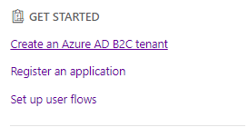


### Tutorial: Create an Azure Active Director B2C Tenant 
https://docs.microsoft.com/en-us/azure/active-directory-b2c/tutorial-create-tenant 

* Just follow the steps.  It is a good tutorial 
* For Azure AD B2C Create tenant I entered:
  * Organization name = **Blazor Server**
  * Initial domain name = **bsomething**
  * Country or region = **United States**
* **Select your B2C tenant directory step**, upper right corner 
    

* Click on **DEFAULT DIRECTORY**  for *Switch Directory* to display


* I had to wait like 5 minutes before clicking on Switch Directory would show the new tentant  
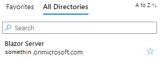

* Add Azure AD B2C as a favorite (optional), this is tricky
  * Hamburger menu -->All Services

    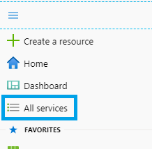 

  * Then follow the remainder of the instructions 

### Register an application
 https://docs.microsoft.com/en-us/azure/active-directory-b2c/tutorial-register-applications?tabs=applications 
Just follow the steps.  Here are some notes that might help clarify things:

* Step 2  
    

* Step 3  
    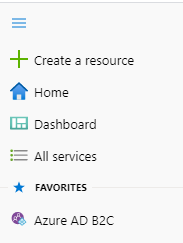
* Step 4 – Use App registrations (Preview) instead  
      
And then  
    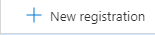
* Step 5  
    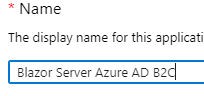

* Step 6 – I believe is obsolete 
* Step 7
  * Read through completely, lot of important info.
  * Choose Web and https://jwt.ms for now.
* Step 8  -- Click on **Register**, not **Create** 

**Note** Lots of good documentation references on tenant page  

### Create Client Secret 

* This doesn't go into a Blazor app, but maybe something else needs it. 


### Tutorial: Create user flows in Azure Active Directory B2C 
https://docs.microsoft.com/en-us/azure/active-directory-b2c/tutorial-create-user-flows

* User Flows are Policies that can be applied to many apps within a tenant, so they are selected and worked on separate from the application.
* Just follow the instructions 

* Step 7.2 – **email signup** – Don't know how to do a User Name signup.  Something TODO . 

* Step 7.4 - User attributes – I select everything, and then click on **Show more...** And select everything on the panel.  During testing, it is a pain to have to enter all this in, but later, you get to see all the return claims in in your app. 
* **NOTE:** Claims in MS Identity are fantastic.  It is a name-value pair table, so you don't have to change the db schema to add a new field, you just define a new claim type.  Definitely worth the read to understand Claims. 

#### Test the User Flow 
* Follow the instructions 
* Step 3.5 Will display the following in a browser
    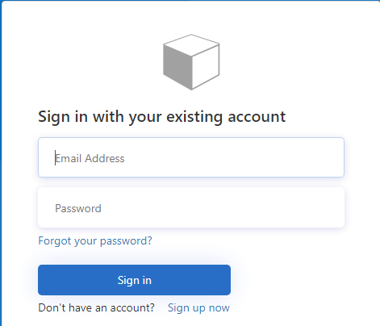
  * This tenant is brand new, and therefore has no accounts in it.  If you try to sign in, you get a "We can't seem to find your account" message.  This is why the flow is SUSI, Sign Up, then Sign In.  
  * Use Sign up Now at bottom of the screen 
* Step 5 – Verification email sometimes feels slow.  Give it a couple of minutes. Fill out the sign  up form. 
* Step 6 – A whole lotta nothin' goin' on.  
    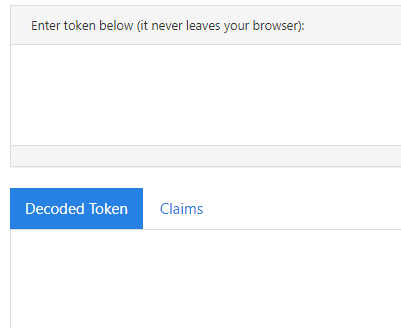
  * Troubleshooting – Earlier, we used the Use **App registrations (Preview)**.  Turns out this should say (Premature) instead, because it didn't actually properly configure the app. 
    * Click on  
        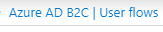
    * Click on  
        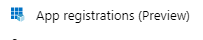
    * Click on the application  
        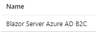
    * In the column on the right side, look for  
        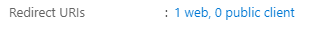
    * Under Implicit Grant  
      * Read what it says about only used in SPA apps.  Someone smarter than me needs to investigate this. 
    * Now go ahead select **Access Tokens** and **ID Tokens**. 
    * Click on Save at the top of the screen. 
    * GOTO (ugh) **Test the User Flow** and repeat. 
  * Voila!  We got tokens and we got Claims.  Idint (sic) that cool?   
  * Without Access and ID tokens check, nothing comes out.  I don't know. 

 #### Create a profile editing user flow  
* Continue as before. 
 
#### Create a password reset user flow 
* Yep, continue. 
*
<span style="color:red">
STOP
</span>   

-- At this point, switch over to **Secure ASP.NET Core Blazor Server apps**:
 https://docs.microsoft.com/en-us/aspnet/core/security/blazor/server?view=aspnetcore-3.1&tabs=visual-studio  
 Before we get all crazy with additional identity providers, let make sure this one works! 

## Secure ASP.NET Core Blazor Server apps 

### Preface
```
The template supports Azure ADB2C out of the box when you choose 
"Individual" authentication then choose the ADB2C sub-option.
https://github.com/dotnet/aspnetcore/issues/11787  Steve Sanderson, 2019-07-02
```   

Lets prove him right.

### Build Blazor App 

* **Configure your new Project** 
* Stop at **Create new Blazor App** 
* Change the Authentication         
    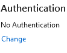
* Switch to Individual User Accounts  
    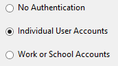
* Change from Store user accounts in-app 
    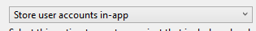
  * To Connect to an existing user store in the cloud 
      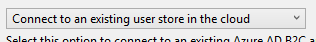
* **Domain Name**  
    * From  Azure AD B2C page (don't forget copy button at the end of each entry)* Domain = something.onmicrosoft.com 
     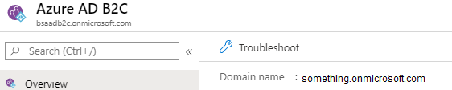
* **Application ID** 
  * From Home --> Azure AD B2C | App registrations (Preview) --> Blazor Server Azure AD B2C 
     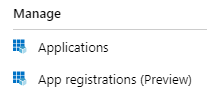
     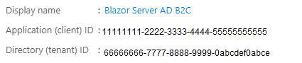
* **CallBack Path** 
    * Should be prepopulated with */signin-oidc*  Do not change 
    * Reply URI: https://locahost:44331/signing-oidc, Click on **Copy** 
    * Return to Azure screen and select **Redirect URIs** 
     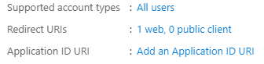
    * Under Web --> Redirect URIs, replace the value with the new one from Visual Studio  
        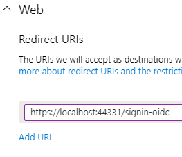
    * **SAVE** 
* **Sign-up or Sign-in Policy** 
    * B2C_1_SUSI 
* **Reset Password Policy** 
    * B2C_1_PasswordReset 
* **Edit Profile Policy** 
    * B2C_1_ProfileEditing 
* Click on **OK**. 
* Click on **Create**. 

##### Mandatory Optional – Save credentials in User Secrets 
* Open *appsettings.json*. 
* Cut out the **AzureAdB2C** element. 
* Right click on project, and select **Manage User Secrets**. 
* Paste the **AzureAdB2C** inside. 
* **Save** 
* Now project ready to be save to repository 
* NOTE:  I left behind a non-functional example in the repo. 

#### Test
* Run the application  
  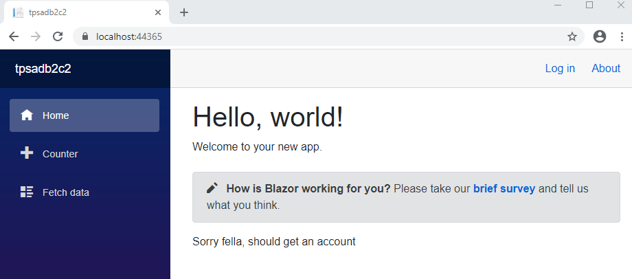
* Click on **Log In**  
  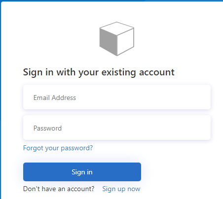
* Click on **Sign up now** 
* Enter an email address 
* Get the Verification code and validate the email address
* Fill in the remain attributes. 
* **Create** 
* If all is successful, you should be logged in. 
* Out of the box like Mr. Sanderson said. 